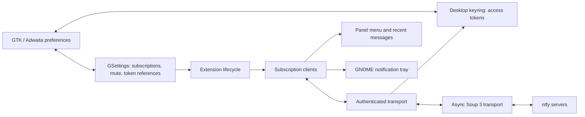

# ntfy for GNOME

[Documentation home](../README.md#documentation) · [User guide](USER_GUIDE.md) · [Development](DEVELOPMENT.md)

## Investigation

The project directory was empty on 2026-09-07: no source, Git repository,
build tooling, or existing extension to migrate. This is a new implementation.
The development container has Node.js, Python, and GLib schema tools, but no
GNOME Shell session. Desktop behavior must be verified separately.

## Product

Receive ntfy messages directly in GNOME without keeping a browser open. The
first useful journey is: enable extension → add server and topic → see a
connected status → publish from another application → receive a notification.

Use GNOME's panel menu, symbolic icons, notification tray, fonts, and theme.
Preferences use GTK 4 and libadwaita. Connection states have text labels;
errors appear beside the subscription or form that needs attention. No custom
palette, bundled fonts, or web UI is necessary.

## Delivery slices

1. **Initial implementation:** public subscriptions on ntfy.sh or self-hosted
   origins; add/remove/enable topics; native notifications; global mute;
   connection status; reconnect; bounded recent messages; installable archive.
2. **Private subscriptions:** per-server bearer tokens in Secret Service;
   explicit locked-keyring and authorization states; credential replacement.
   Tokens never belong in GSettings, query parameters, or logs.
3. **Reliability and richer messages:** persistent replay checkpoints, sleep
   and network recovery testing, per-topic priority/mute controls, message
   update/delete semantics, and optional retained history.
4. **Release:** real Shell version matrix, accessibility and theme checks,
   translations, packaging metadata and license notices, extension review.

The first two slices are implemented, with further verification required before
a public release. GNOME 46–50 is the provisional API target, pending the user's
desktop version and runtime verification. GNOME 45 and older need a separate
compatibility decision. The public submission uses `ntfy@shukiv.github.io`;
the earlier `ntfy@ntfy.gnome` prototype requires a one-time installation migration.

Initial status: slices 1 and 2 are implemented. Protocol/lifecycle tests, the
real GJS networking fixture, native preferences, and disposable GNOME Keyring
tests pass; actual Shell integration and the declared desktop version matrix
remain unverified.

## Architecture

| Module | Responsibility |
| --- | --- |
| `extension.js` | Own settings, clients, panel, notification source, teardown |
| `prefs.js` | Validated subscription management and notification settings |
| `lib/config.js` | Subscription validation and canonical server identity |
| `lib/protocol.js` | Bounded JSON framing, message normalization, deduplication |
| `lib/client.js` | Transport-independent reconnect and cancellation lifecycle |
| `lib/transport.js` | Soup 3 / Gio asynchronous HTTP operations |
| `lib/auth.js` | Cancel-safe authentication before opening a stream |
| `lib/secrets.js` | Asynchronous libsecret storage and noninteractive background lookup |
| `lib/tokenSettings.js` | Publish keyring references after successful storage |
| `lib/tokenPreferences.js` | Masked token editor, replacement, removal and explicit unlock |
| `schemas/` | Persistent configuration, without message contents or secrets |

Use plain JavaScript ES modules. No transpiler or runtime npm dependencies.
Keep policy and protocol logic independent of GNOME so Node can test it; test
the real GJS transport against a local fixture server as well.

## Subscription contract

Configuration is a JSON array in GSettings. Each record has a stable `id`,
canonical `server` origin, `topic`, and `enabled` flag. A `(server, topic)` pair
must be unique. Limit configuration to 20 subscriptions to bound resources.
The initial UI accepts HTTP(S) origins, including ports; reverse-proxy subpaths
are outside the first slice. HTTP is available for explicitly configured LAN
servers. HTTPS is the default and certificate validation stays enabled.

Authenticated servers require HTTPS, with an exception for loopback development.
The `server-credentials` GSettings dictionary maps a canonical origin to an opaque
keyring item ID. The secret itself is stored in Secret Service with origin and
ID attributes. Replacement stores a new item before switching the reference,
then removes the old item. Failure to update settings rolls back the new item.
Each connection reads its token from the keyring; there is no persistent token
cache. Failed or locked lookups stop the connection without anonymous fallback
or a background unlock prompt. Explicit Unlock in preferences triggers a retry
for that server through a nonsecret `credential-retry` origin/nonce setting.
Removing a subscription retains its shared server token until explicitly removed.

Each enabled topic owns one asynchronous connection. This keeps replay
positions, failures, and future permissions independent. Connection sharing
can be revisited if actual usage justifies it.

Consume newline-delimited JSON from `/<topic>/json`. Ignore protocol control
events and malformed messages. Retry interrupted streams using an in-memory
timestamp checkpoint and bounded message-ID deduplication. Include the last
second in replay so messages with equal timestamps aren't skipped. Start at
the subscription's activation time with one second of overlap; don't load the
entire historical cache.
Recovery depends on server retention and is not an exactly-once guarantee.

Transient failures use exponential backoff with jitter, capped at 60 seconds;
honor bounded `Retry-After`. Permanent HTTP errors wait for manual retry or
configuration changes. Bound input lines to 64 KiB and recent history to 20
messages. Disabling the extension cancels requests and timers, disconnects
signals, destroys notifications and UI, and drops in-memory state.

## Notification behavior

- Message title falls back to the topic; body is plain text.
- Priorities 1–2 use low urgency; 3–5 use normal urgency. A publisher cannot
  force a critical notification through the user's Do Not Disturb setting.
- Mute suppresses new desktop notifications while reception and history continue.
- Only an explicit user action opens a validated HTTP(S) link. Unknown action
  types, HTTP actions, attachments, and publisher commands are not executed.
- History lives in memory and is cleared on disable, lock, logout, or restart.
  The extension runs only in the normal user session, not on the lock screen.
- Expanding Recent messages shows each body directly in an always-visible
  section, with its topic/title, local timestamp and explicit browser actions.
  Titles matching the topic are not repeated. Wrapped text and Shell's submenu
  scrolling accommodate longer messages; desktop layout validation is pending.
  New arrivals update the count; contents refresh when the row is expanded,
  avoiding actor replacement and focus changes while someone is reading.
- No default topic is subscribed and enabling the extension alone sends no request.

## Acceptance checks

Automated: validation, fragmented UTF-8 framing, malformed/oversized data,
duplicate messages, independent checkpoints, reconnect backoff, HTTP failures,
cancellation during connection/read/retry, schema compilation, archive contents,
and a local Soup integration test.

Desktop: preferences add/remove/toggle; publish a unique test message; mute;
Do Not Disturb; reconnect after offline/suspend; disable/re-enable; lock/unlock;
check for leaked timers and actors; keyboard navigation; long text and scaling;
light/dark themes. Run on each declared Shell version before claiming support.

## Sources

- [ntfy subscription API](https://docs.ntfy.sh/subscribe/api/): transport and replay.
- [GNOME notifications](https://gjs.guide/extensions/topics/notifications.html): tray API.
- [GNOME preferences](https://gjs.guide/extensions/development/preferences.html): settings and process boundary.
- [Extension review guidelines](https://gjs.guide/extensions/review-guidelines/review-guidelines.html): lifecycle cleanup.
- [GNOME notification design](https://developer.gnome.org/hig/patterns/feedback/notifications.html): native interaction.
- [Soup asynchronous requests](https://libsoup.gnome.org/libsoup-3.0/method.Session.send_async.html).
- [ntfy token authentication](https://docs.ntfy.sh/publish/#access-tokens).
- [libsecret search and unlock flags](https://gnome.pages.gitlab.gnome.org/libsecret/method.Service.search.html).
- [GNOME 50 migration](https://gjs.guide/extensions/upgrading/gnome-shell-50.html).
- Shell notification implementations inspected at upstream tags
  [46.0](https://github.com/GNOME/gnome-shell/blob/46.0/js/ui/messageTray.js) and
  [50.0](https://github.com/GNOME/gnome-shell/blob/50.0/js/ui/messageTray.js).
